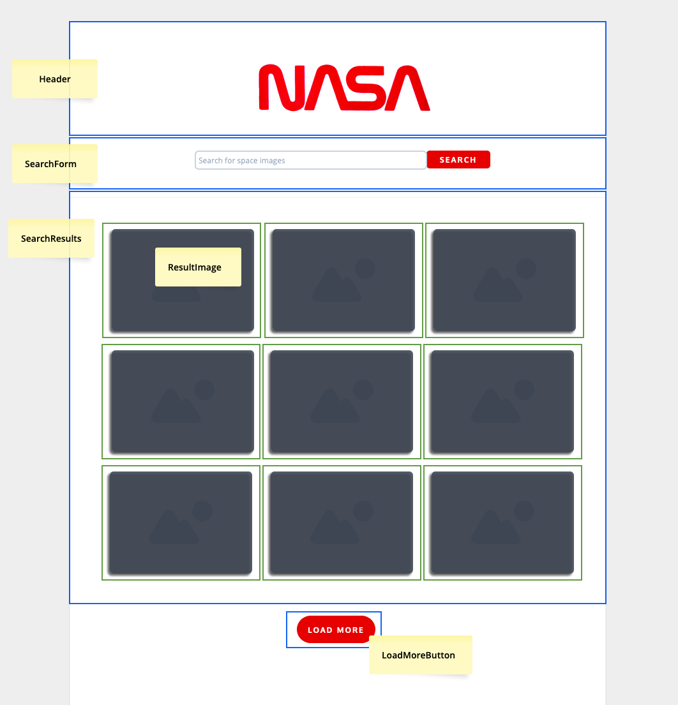

# Machester Codes React Technical Test

## The Brief

Technical Task - React Developer Role

You are expected to build a React web application that allows space fans to search for images based on a query relating to space. You are provided the NASA API endpoint for image search.  

We want you to consider and add anything to your repository that should be included was this to be a live website.

The following functionalities need to be implemented:
● A Search page which allows space fans to search for images by keyword
● Images must be returned upon a successful search

The styling is up to you but will be taken into consideration when evaluating your application.

We estimate this task to take ​​10 hours​​. Once you have completed the task upload the repository to GitHub and send the link to xxxxx@xxx.com. ​Deadline: 5 days from receiving.

Relevant API endpoints:

image search:
GET​​ ​​https://images-api.nasa.gov/search ​Params: ​​q

Assets

You may use this asset for your application: https://cdn.cnn.com/cnnnext/dam/assets/200424060716-nasa-worm-logo.jpg

Example below:

***

## Planning Stages

### User Stories - Necessary

As a space fan...

- [ ] I want to enter a search term,  
So that I can get space images of a certain content.  
   

- [ ] I want to see results displayed in image form,  
So I can quickly decide which image to use.  
   

- [ ] I want to click to open the original image,
So I can access the image in its original size.
 
  
- [ ] I want to receive an appropriate message if a search has no results,
So I understand why no images have been returned.  
   

### User Stories - Desirable Extras

- [ ] I'd like a limited number of results to be returned, 
So the page doesn't load too slowly 
- [ ] and I'd like a load more button,  
So I can choose to see more results.  
 
- [ ] I'd like the option to click through to the original,  
So I can get more information about this image.    
 
- [ ] I'd like to filter results by type,  
So I can get images of a certain category by keyword.  
(e.g. real moon images as opposed to representations/informational)  
 
- [ ] I'd like to get a random collection of images,  
without entering a keyword.

### Initial Mockup with Component map

***  

