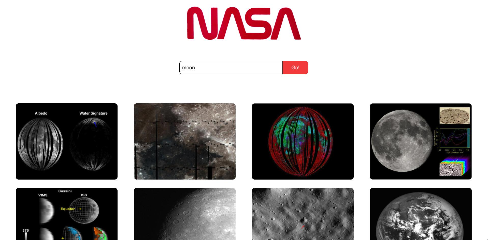
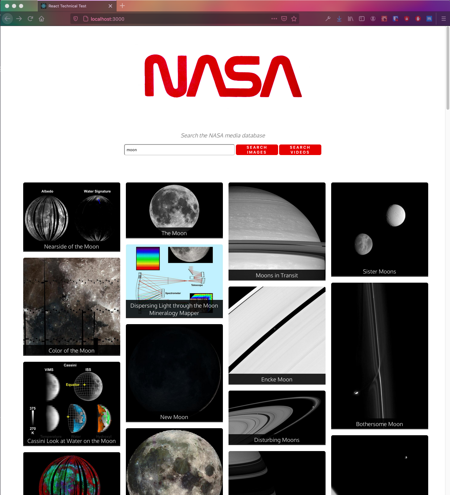
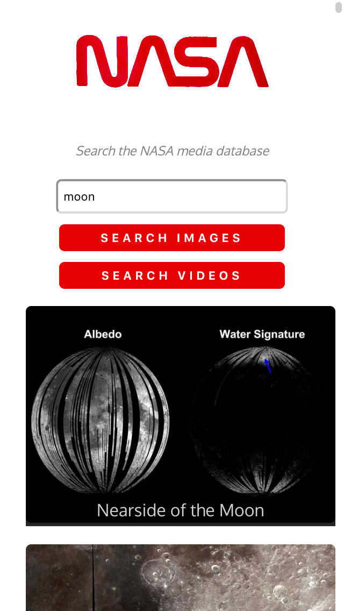
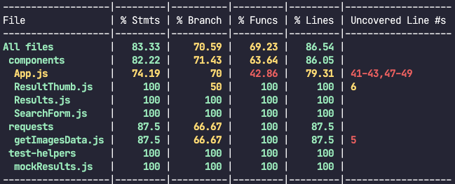

# Machester Codes React Technical Test

## Contents

1. [The Brief](#the-brief)
2. [Screenshots](#screenshots)
3. [Tech Stack](#tech-stack)
4. [Fulfilled User Stories](#user-stories)
5. [Run the app](#run-it)
6. [View it online](#view-it-online)
7. [If I had more time...](#if-i-had-more-time)

### The Brief

For this technical test, the brief is to create a React web application that allows space fans to search for images based on a query relating to space.

Requirements  

- A Search page which allows space fans to search for images by keyword  

- Images must be returned upon a successful search  

Styling will also be considered.

A nasa logo and has been provided: https://cdn.cnn.com/cnnnext/dam/assets/200424060716-nasa-worm-logo.jpg

The relevant endpoint also is provided:
image search:
GET​​ ​​https://images-api.nasa.gov/search ​Params: ​​q

And this example is given:

---

### Screenshots:

**Browser:**

 

 
 

**Mobile:**

 

---

### Tech Stack

- React (Functional components + hooks)
- Plain ol' CSS

**For testing**
- React Testing Library + Jest
- Postman

**Packages**
- PropTypes
- Axios

---

### User Stories

As a space fan...

- [x] I want to enter a search term,  
  So that I can get space images of a certain content.  
   

- [x] I want to see results displayed in image form,  
  So I can quickly decide which image to use.  
   

- [x] I want to click to open the original image,  
  So I can access the image in its original size.  
   

- [x] I want to receive an appropriate message if a search has no results,  
  So I understand why no images have been returned.  
   

- [x] I'd like to also search for videos,  
  So I can access more of Nasa's media.  
   

---

### Run it

- Clone this repo.
- `cd` into the project folder.
- `npm start` to run it locally in your browser.
- `npm test` to run the tests.

--- 

### View it online

It's deployed with Vercel: https://nasa-image-search-tawny.vercel.app/

---

### If I had more time...

**I'd improve the styling**, especially on mobile and very large screens, and refactor my CSS. 

Styling also needs some adjustments for displaying video results, as the video thumbnails are generally smaller than the image thumbnails. The titles are wider than the images in full screen on a standard laptop.

I'd possibly switch to using StyledComponents or Sass to make the web app more maintainable and easier to develop further.

 

**I would write more tests** to improve test coverage. Here's the current coverage report:

We can see that some branches and functions haven't been tested. These are related to the videos search and the navigation - loading previous and next pages. So I would complete the test suite by testing the key functionality of these features.

 

**I'd investigate a bug:** when clicking 'next page' on a video search, the next page loads fine, but in the browser console we get a rejected request with code 403: Forbidden. This doesn't happen when we get the next page of images.

 

Also, I'd have a go at implementing the following:

**User Stories - Desirable Extras**

As a space fan...

- [ ] I'd like the results to load faster, 
for a smoother experience.
       
- [ ] I'd like the option to click through to get more information,  
      So I can use it as a research tool. 
       
- [ ] I'd like to filter results by type,  
      So I can get images of a certain category by keyword.  
      (e.g. real moon images as opposed to representations/informational)  
       

- [ ] I'd like to get a random collection of images,  
      without entering a keyword.
 

---

### Author
Anna Balquin

